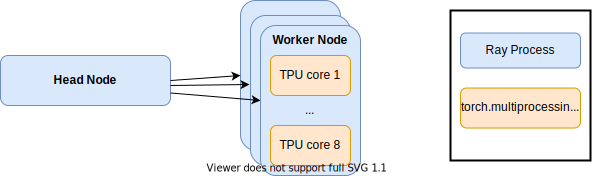

So, you finally got your free TPU credits through Google's [TRC program](https://sites.research.google/trc/about/) and want to make good use of it?
Then you've come to the right place.
This post will show you how to run hyperparameter optimization on as many TPUs as you can get your hands on.
For that, we will tune a 🤗-transformers model in Pytorch.

// Whats a TPU, what model, motivation, ..., TRC
// What you will get out of this

## Hyperparamer Search

Hyperparameters are parameters of your deep learning model that are not tuned by gradient descent like learning rate, weight decay, or the number of layers in the architecture.

The standard approach to pick a good set of hyperparameters is through *hyperparameter optimization*, which requires training multiple models, each with a different set of hyperparameters, in order to select the one with the best performance.
On the one hand, the large number of trials required makes hyperparameter optimization computationally costly.
On the other hand, multiple trials can be evaluated in parallel without the need of communication while training.
This makes it feasible, and often necessary, to run the workload on multiple nodes in parallel.

This is where [Ray Tune](https://docs.ray.io/en/latest/tune/index.html) shines:
It is a library for distributed hyperparameter optimization build on top of Ray.
With only a few lines of code, we can can implement different hyperparameter optimization techniques.
All we need to do is define the search space of hyperparameters and a function that registers the metrics for our model (see the [github repo](https://github.com/dsuess/transformers-mup/blob/ray-on-tpu/run.py#L77) for the actual implementation):

```python
import ray.tune as rt

def run_train(config: Dict):
    ...
    for epoch in config["num_train_epochs"]:
        ...
        rt.report(eval_loss=...)

search_space = {
    "learning_rate": rt.loguniform(1e-6, 1e-2),
    "warmup_ratio": rt.uniform(0, 0.1),
    "num_train_epochs": rt.uniform(20, 50),
}
train_fun = ft.partial(run_train, ...)
analysis = rt.run(
    train_fun,
    config=search_space,
    time_budget_s=60 * 60,
    search_alg=HyperOptSearch(metric="eval_loss", mode="min"),
    scheduler=ASHAScheduler(metric="eval_loss", mode="min"),
    ...
)
```

The same code can now run either on your local machine or on [Ray cluster](https://docs.ray.io/en/latest/cluster/index.html) with hundreds of worker nodes.


## P for Power

The other key in making hyperparameter search for deep learning models fast is to use multiple accelerators such as GPUs or TPUs.
For multi-GPU training, Ray tune nicely integrates with the both pytorch's [DataParallel](https://docs.ray.io/en/latest/tune/tutorials/tune-pytorch-cifar.html#adding-multi-gpu-support-with-dataparallel) and [DistributedDataParallel](https://docs.ray.io/en/latest/tune/tutorials/tune-pytorch-cifar.html#advanced-distributed-training-with-distributeddataparallel).
The latter can be significantly faster, even for single-node training, as it runs a separate process for each GPU.

The same is true when running on TPU nodes:
Each node has 8 separate TPU cores, each of which requires a seprate Python process to run.
However, launching the necessary processes requires additional bookkeeping and should be done by [PyTorch XLA](https://github.com/pytorch/xla), the library that enables using TPUs PyTorch.
Therefore, we cannot simply re-use the existing DistributedDataParallel wrapper provided by Ray tune.

Instead, we will manually need to launch the TPU-core worker processes on each Ray worker node using Pytorch XLA's multiprocessing module:




## Communication

The remaining challenge is how to return the model's validation scores back to Ray tune.
Ideally, we report the scores back after each epoch.
This way we can make use of early stopping and terminate unfavourable trials early on.
Since the scores are computed in the TPU-worker processes, but reporting to Ray-tune needs to happen from the Ray-worker process, we use a simple Queue to push results from the former to the latter ([full implementation](https://github.com/dsuess/transformers-mup/blob/ray-on-tpu/run.py#L22)):


```python
def _handle_distributed(config: Dict[str, Any]):
    import torch_xla.distributed.xla_multiprocessing as xmp

    mp.set_start_method("spawn")
    queue = mp.Queue()
    context = xmp.spawn(_launch_mp, args=(config, 8, queue), nprocs=8, join=False)
```

Ray-tune launches this function on each Ray-worker node with different hyperparameter-values in `config.
Then in turn, the last line launches 8 worker processes on each node -- one for each TPU core -- with the entrypoint [`_launch_mp`](https://github.com/dsuess/transformers-mup/blob/ray-on-tpu/training.py#L30).
We set `join=False` so the Ray-worker node can continue running and process messages sent by the TPU-workers through `queue`:

```python
    try:
        while True:
            if not all(p.is_alive() for p in context.processes):
                break

            try:
                res = queue.get(block=True, timeout=1)
            except Empty:
                pass
            else:
                if isinstance(res, dict):
                    rt.report(**res)
                else:
                    raise NotImplementedError(f"No idea how to handle {res}")

    finally:
        queue.close()
        context.join()
```
For now, we only expect messages in the queue consisting of a dictionary containing the validation-metrics.

Within the TPU-worker nodes, we implement sending metrics through the queue through a simple [TrainerCallback](https://github.com/dsuess/transformers-mup/blob/ray-on-tpu/training.py#L16):

```python
from transformers.trainer_callback import TrainerCallback, TrainerState

class TuneReporterCallback(TrainerCallback):
    def __init__(self, result_queue: Queue):
        self.result_queue = result_queue

    def on_evaluate(self, args, state: TrainerState, control, **kwargs):
        self.result_queue.put(state.log_history[-1])
```

To make sure we do not record metrics multiple times, the callback is [only run](https://github.com/dsuess/transformers-mup/blob/ray-on-tpu/training.py#L76) on the 0th TPU worker node.


## Running